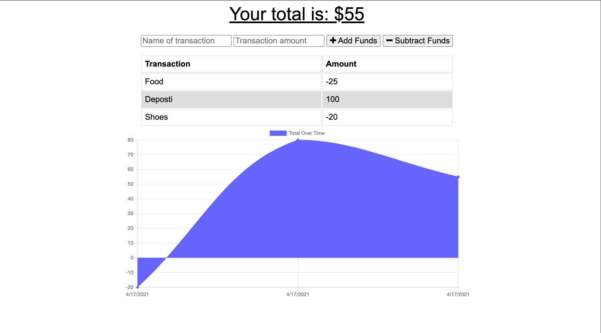

[](https://opensource.org/licenses/MIT)

  # Budget Tracker

  ## Description

  An application which allows users a fast and easy way to readily monitor their finances. The application offers offline functionality via the use of IndexedDB thus allowing the user to:
  
  - Enter deposits offline
  - Enter expenses offline
  - Submit entries to the tracker when application reconnects to the network. 
  
  The application can also be installed to a user's mobile device allowing them to always be able to tracker their budget.

  Link: https://budget-trakr.herokuapp.com/

  ## Table of Contents

  * [Installation](#installation)
  * [License](#license)
  * [Contributing](#contributing)
  * [Questions](#questions)

  ### Installation
  
  ```
  npm i
  ```


  ### License
  This project is licensed under [MIT](https://opensource.org/licenses/MIT)

  ### Contributing
  
  No contributions at this time.


  ## Questions
  
  If you have any questions about the repo, please contact me at j.taylor1343@gmail.com.

  You can find more of my work and projects at [johannt91](https://github.com/johannt91).



